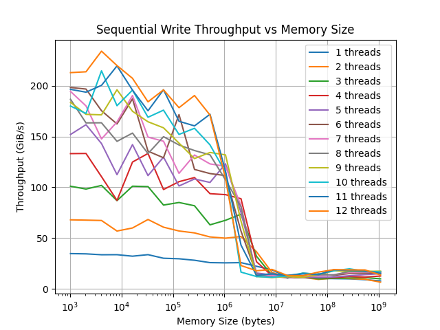

## Sequential Memory Write Benchmark (Multithreaded)

This benchmark evaluates how memory write throughput scales with:
- increasing memory size
- increasing number of threads

## Setup:
- CPU: 12 cores
- Cache hierarchy:
    - L1: 32 KB
    - L2: 256 KB
    - L3: 12 MB
- Benchmark: sequential writes to memory
- Metric: throughput (GiB/s)

```bash
$ clang++-17 -g -O3 -mavx2 -Wall -pedantic -I$GBENCH_DIR/include SMT_sequantial.cpp $GBENCH_DIR/build/src/libbenchmark.a -pthread -lrt -lm -o smt_sequential
$ ./smt_sequential
```

## Results:



## Key Observations:

### 1. Near-linear scaling within cache

For working sets that fit into L1/L2 cache, throughput scales almost linearly with the number of threads:
- Minimal contention
- Data stays close to CPU
- Extremely high bandwidth (up to ~200+ GiB/s)

### 2. Diminishing returns in L3

When entering the L3 cache region (~12MB):
- Scaling continues but slows down

### 3. Memory bandwidth bottleneck (RAM)

For working sets larger than L3:
- Throughput drops significantly (~10–20 GiB/s)
- Adding more threads does not improve performance

This indicates a transition from **compute-bound** to **memory-bound**

## Key Takeaways:

- Multithreading is highly effective only when data fits into CPU caches
- For large memory workloads, performance is limited by memory bandwidth
- Increasing thread count beyond a certain point leads to:
    - contention
    - no real performance gain

The transition from L2 to L3 introduces a fundamental architectural shift:

- L1/L2 are private per core → near-linear scaling
- L3 is a shared resource → contention and coherence overhead emerge

This results in:
- reduced scaling efficiency
- increased memory access latency
- early signs of bandwidth saturation before reaching DRAM

This effect is especially visible in multi-threaded workloads where threads operate on independent memory regions but still share the last-level cache.